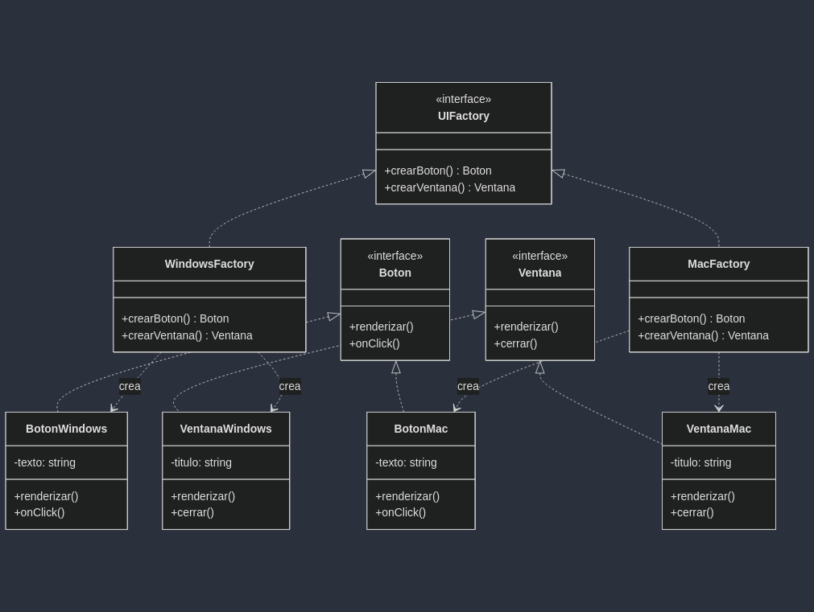

# Patrón Abstract Factory para UI Multiplataforma

## Descripción del Proyecto
Este proyecto implementa el patrón de diseño Abstract Factory para crear interfaces gráficas multiplataforma (Windows y Mac). El patrón permite crear familias de componentes de UI relacionados sin especificar sus clases concretas, facilitando la adaptación de la aplicación a diferentes plataformas.

## Diagrama UML


El diagrama UML muestra la estructura del patrón Abstract Factory con:
- Una interfaz abstracta `UIFactory` que define los métodos para crear componentes de UI
- Fábricas concretas (`WindowsFactory` y `MacFactory`) que implementan los métodos para crear componentes específicos
- Interfaces para productos abstractos (`Boton` y `Ventana`)
- Implementaciones concretas para cada plataforma con sus métodos exclusivos

## Estructura del Proyecto
```
├── factories/
│   ├── __init__.py
│   ├── windows_factory.py
│   └── mac_factory.py
├── models/
│   ├── __init__.py
│   ├── abstract.py
│   ├── windows/
│   │   ├── __init__.py
│   │   ├── boton.py
│   │   └── ventana.py
│   └── mac/
│       ├── __init__.py
│       ├── boton.py
│       └── ventana.py
├── diagrams/
│   └── AbstractFactory.png
├── main.py
└── README.md
```

## Cómo Ejecutar
Para ejecutar el programa, simplemente ejecute el archivo main.py:

```bash
python main.py
```